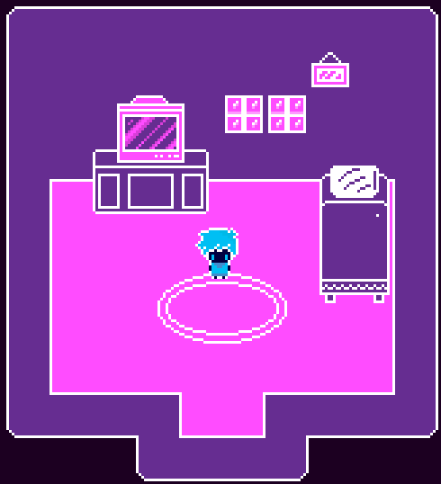

# Astro Adventure

Astro Adventure is a 2D game made with GameMaker.

This project is my first real game developed with GameMaker. The goal is to learn game development, programming, game design, and project organization while creating a fun playable experience.

## Features

* Main menu
* In-game menu
* AstroWatch system
* Inventory system
* Fullscreen support
* Multiple rooms and locations
* Keyboard navigation (WASD, Enter, ESC, TAB)

## Controls

| Key   | Action            |
| ----- | ----------------- |
| W / S | Navigate menus    |
| Enter | Confirm selection |
| ESC   | Go back           |
| TAB   | Open in-game menu |
| F11   | Toggle fullscreen |

## Screenshot

## Development

The game is currently in development and many features are still work in progress.

### Planned Features

* More locations to explore
* Interactive objects
* Dialogues and story elements
* Improved inventory system
* Settings menu
* Better graphics and animations
* Sound effects and music

## Built With

* GameMaker
* GML (GameMaker Language)

## Author

Created with passion by me.

This project is part of my learning journey in game development.